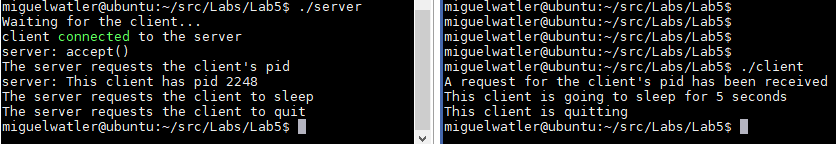

# SEP400 - Lab 4: Server/Client Communications

The recording for lab 4 can be found at [Lab4.mp4](https://seneca-my.sharepoint.com/:v:/g/personal/miguel_watler_senecacollege_ca/EY5WU0vrfpFKo_7MMvbDWAcBP-GpjoAh3vuMSjvuOyRRoA?e=Tfo3ul).

## Due: Friday, February 17, 2023

In this lab you will create two processes: **server** and **client**. They will communicate with each other through a socket connection. The relationship of the **server** to the **client** is that of a master to a slave. The **server** will send commands to the **client** and the **client** will obey and respond. This type of communications is called synchronous, in that the **server** does not send any more data until it has received a response from the **client**.

 

- The **server** and **client** will communicate via a socket file `/tmp/lab4`.

- The socket type is `AF_UNIX, SOCK_STREAM`. The socket family is `AF_UNIX`.

- The **client** will run inside an infinite while loop whereas the **server** will send specific commands then quit.
- The sequence of commands are as follows:
    1. The **server** will send the command **"Pid"** to the client to request the client's pid.
    2. The **client** will respond with **"This client has pid < pid >"**, where < pid > can be obtained from `getpid()`.
    3. The **server** will print out the response from the **client**.
    4. The **server** will then send the command **"Sleep"** to the **client** to request the **client** to sleep for 5 seconds.
    5. The **client** will sleep for 5 seconds then respond to the server with "Done".
    6. When the **server** receives **"Done"** from the **client**, the **server** will send the command **"Quit"** to tell the **client** to shutdown.
    7. The **client** will break out of its infinite while loop, close the socket connection, then return 0.
    8. The **server** will **close** all socket connections, **unlink** the socket file `/tmp/lab4`, then return 0.
- Be sure to add error handling in your code.
- Please add debug printf's/cout's throughout your code to keep track of what your **server** and **client** are doing.
- A sample run for the **server** and **client** are as follows (be sure to run the **server** first):

    