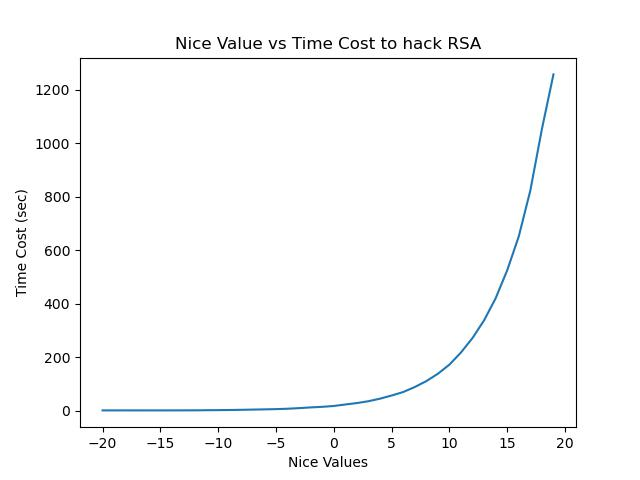

# Lab 9 Questions

Yiyuan Dong

## 1. It takes quite a bit of time to hack such a small value of n (0.5 seconds at best). How long do you think it would take to hack an n which is 1024 bits?

The number used in the lab is 5335952767283123. 

To find the factors, the worse case is brute forcing from 2 to the square root of n. In this case, roughly 

$$7.3\cdot10^7$$

1024 bits can represent number up to $$2^{1024}$$.

Take the square root, the number is around $$1.34\cdot10^{154}$$.

Do the division: $$\frac{1.34\cdot10^{154}}{7.3\cdot10^7} = {1.84 \cdot 10^{147}}$$

Which means hacking 1024 bits would take $${1.84 \cdot 10^{147}\cdot0.5} = 9.2\cdot10^{146}\; seconds$$

1 year is $$3.154\cdot10^7\; second$$

So, hacking 1024 bits takes more than 20 years in this case.

## 2. When you were at the lowest nice value, how much cpu time was your hack process taking?

    At nice value of -20, it took 1.84176 second.

## 3. When you were at the highest nice value, how much cpu time was your hack process taking?

    At nice value of +19, it took almost 21 mins.

## 4. When you were at the middle nice value (nice=0), how much cpu time was your hack process taking?

    At nice  value of 0, it took 18 seconds.

## Graph of nice value vs time cost to hack n

